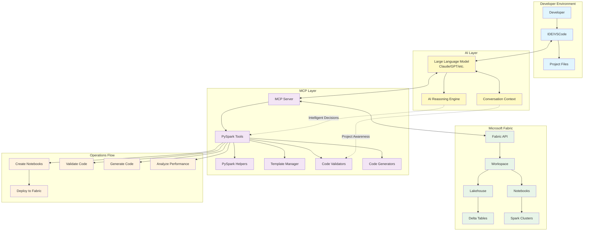

# Microsoft Fabric MCP Server

A comprehensive Python-based MCP (Model Context Protocol) server for interacting with Microsoft Fabric APIs, featuring advanced PySpark notebook development, testing, and optimization capabilities with LLM integration.

## 🚀 Features

### **Core Fabric Operations**
- ✅ Workspace, lakehouse, warehouse, and table management
- ✅ Delta table schemas and metadata retrieval
- ✅ SQL query execution and data loading
- ✅ Report and semantic model operations

### **Advanced PySpark Development**
- 📓 **Intelligent notebook creation** with 6 specialized templates
- 🔧 **Smart code generation** for common PySpark operations
- ✅ **Comprehensive validation** with syntax and best practices checking
- 🎯 **Fabric-specific optimizations** and compatibility checks
- 📊 **Performance analysis** with scoring and optimization recommendations
- 🚀 **Real-time monitoring** and execution insights

### **LLM Integration**
- 🤖 **Natural language interface** for PySpark development
- 🧠 **Context-aware assistance** with conversation memory
- 🎨 **Intelligent code formatting** and explanations
- 📈 **Smart optimization suggestions** based on project patterns

## 🏗️ Architecture



### **Interaction Flow**
1. **Developer requests assistance in IDE**
2. **IDE communicates with LLM (Claude/GPT)**
3. **LLM analyzes using context and reasoning**
4. **LLM calls MCP server tools intelligently**
5. **MCP tools interact with Fabric API**
6. **Results flow back through LLM with intelligent formatting**
7. **Developer receives contextual, smart responses**

## 📋 Requirements

- **Python 3.12+**
- **Azure credentials** for authentication
- **uv** (from astral): [Installation instructions](https://docs.astral.sh/uv/getting-started/installation/#installing-uv)
- **Azure CLI**: [Installation instructions](https://learn.microsoft.com/en-us/cli/azure/install-azure-cli?view=azure-cli-latest)
- **Optional: Node.js** for MCP inspector: [Installation instructions](https://nodejs.org/en/download)

## 🔧 Installation

1. **Clone the repository:**
   ```bash
   git clone https://github.com/your-repo/fabric-mcp.git
   cd fabric-mcp
   ```

2. **Set up virtual environment:**
   ```bash
   uv sync
   ```

3. **Install dependencies:**
   ```bash
   pip install -r requirements.txt
   ```

## 🚀 Usage

1. **Using STDIO**

### **Connect to Microsoft Fabric**

```bash
az login --scope https://api.fabric.microsoft.com/.default
```

### **Running with MCP Inspector**

```bash
uv run --with mcp mcp dev fabric_mcp.py
```
This starts the server with inspector at `http://localhost:6274`.

### **VSCode Integration**

Add to your `launch.json`:
```json
{
    "mcp": {
        "servers": {
            "ms-fabric-mcp": {
                "type": "stdio",
                "command": "<FullPathToProjectFolder>\\.venv\\Scripts\\python.exe",
                "args": ["<FullPathToProjectFolder>\\fabric_mcp.py"]
            }
        }
    }
}
```

2. **Using HTTP**
### **Start the MCP Server**
```bash
uv run python .\fabric_mcp.py --port 8081
```

### **VSCode Integration**

Add to your `launch.json`:
```json
{
    "mcp": {
        "servers": {
            "ms-fabric-mcp": {
                "type": "http",
                "url": "http://<localhost or remote IP>:8081/mcp/",
                "headers": {
                    "Accept": "application/json,text/event-stream",
                }
            }
        }
    }
}
```

## 🛠️ Complete Tool Reference

### **1. Workspace Management**

#### `list_workspaces`
List all available Fabric workspaces.
```python
# Usage in LLM: "List all my Fabric workspaces"
```

#### `set_workspace`
Set the current workspace context for the session.
```python
set_workspace(workspace="Analytics-Workspace")
```

### **2. Lakehouse Operations**

#### `list_lakehouses`
List all lakehouses in a workspace.
```python
list_lakehouses(workspace="Analytics-Workspace")
```

#### `create_lakehouse`
Create a new lakehouse.
```python
create_lakehouse(
    name="Sales-Data-Lake",
    workspace="Analytics-Workspace",
    description="Sales data lakehouse"
)
```

#### `set_lakehouse`
Set current lakehouse context.
```python
set_lakehouse(lakehouse="Sales-Data-Lake")
```

### **3. Warehouse Operations**

#### `list_warehouses`
List all warehouses in a workspace.
```python
list_warehouses(workspace="Analytics-Workspace")
```

#### `create_warehouse`
Create a new warehouse.
```python
create_warehouse(
    name="Sales-DW",
    workspace="Analytics-Workspace", 
    description="Sales data warehouse"
)
```

#### `set_warehouse`
Set current warehouse context.
```python
set_warehouse(warehouse="Sales-DW")
```

### **4. Table Operations**

#### `list_tables`
List all tables in a lakehouse.
```python
list_tables(workspace="Analytics-Workspace", lakehouse="Sales-Data-Lake")
```

#### `get_lakehouse_table_schema`
Get schema for a specific table.
```python
get_lakehouse_table_schema(
    workspace="Analytics-Workspace",
    lakehouse="Sales-Data-Lake",
    table_name="transactions"
)
```

#### `get_all_lakehouse_schemas`
Get schemas for all tables in a lakehouse.
```python
get_all_lakehouse_schemas(
    workspace="Analytics-Workspace",
    lakehouse="Sales-Data-Lake"
)
```

#### `set_table`
Set current table context.
```python
set_table(table_name="transactions")
```

### **5. SQL Operations**

#### `get_sql_endpoint`
Get SQL endpoint for lakehouse or warehouse.
```python
get_sql_endpoint(
    workspace="Analytics-Workspace",
    lakehouse="Sales-Data-Lake",
    type="lakehouse"
)
```

#### `run_query`
Execute SQL queries.
```python
run_query(
    workspace="Analytics-Workspace",
    lakehouse="Sales-Data-Lake",
    query="SELECT COUNT(*) FROM transactions",
    type="lakehouse"
)
```

### **6. Data Loading**

#### `load_data_from_url`
Load data from URL into tables.
```python
load_data_from_url(
    url="https://example.com/data.csv",
    destination_table="new_data",
    workspace="Analytics-Workspace",
    lakehouse="Sales-Data-Lake"
)
```

### **7. Reports & Models**

#### `list_reports`
List all reports in a workspace.
```python
list_reports(workspace="Analytics-Workspace")
```

#### `get_report`
Get specific report details.
```python
get_report(workspace="Analytics-Workspace", report_id="report-id")
```

#### `list_semantic_models`
List semantic models in workspace.
```python
list_semantic_models(workspace="Analytics-Workspace")
```

#### `get_semantic_model`
Get specific semantic model.
```python
get_semantic_model(workspace="Analytics-Workspace", model_id="model-id")
```

### **8. Basic Notebook Operations**

#### `list_notebooks`
List all notebooks in a workspace.
```python
list_notebooks(workspace="Analytics-Workspace")
```

#### `get_notebook_content`
Retrieve notebook content.
```python
get_notebook_content(
    workspace="Analytics-Workspace",
    notebook_id="notebook-id"
)
```

#### `update_notebook_cell`
Update specific notebook cells.
```python
update_notebook_cell(
    workspace="Analytics-Workspace",
    notebook_id="notebook-id",
    cell_index=0,
    cell_content="print('Hello, Fabric!')",
    cell_type="code"
)
```

### **9. Advanced PySpark Notebook Creation**

#### `create_pyspark_notebook`
Create notebooks from basic templates.
```python
create_pyspark_notebook(
    workspace="Analytics-Workspace",
    notebook_name="Data-Analysis",
    template_type="analytics"  # Options: basic, etl, analytics, ml
)
```

#### `create_fabric_notebook`
Create Fabric-optimized notebooks.
```python
create_fabric_notebook(
    workspace="Analytics-Workspace",
    notebook_name="Fabric-Pipeline",
    template_type="fabric_integration"  # Options: fabric_integration, streaming
)
```

### **10. PySpark Code Generation**

#### `generate_pyspark_code`
Generate code for common operations.
```python
generate_pyspark_code(
    operation="read_table",
    source_table="sales.transactions",
    columns="id,amount,date"
)

# Available operations:
# - read_table, write_table, transform, join, aggregate
# - schema_inference, data_quality, performance_optimization
```

#### `generate_fabric_code`
Generate Fabric-specific code.
```python
generate_fabric_code(
    operation="read_lakehouse",
    lakehouse_name="Sales-Data-Lake",
    table_name="transactions"
)

# Available operations:
# - read_lakehouse, write_lakehouse, merge_delta, performance_monitor
```

### **11. Code Validation & Analysis**

#### `validate_pyspark_code`
Validate PySpark code syntax and best practices.
```python
validate_pyspark_code(code="""
df = spark.table('transactions')
df.show()
""")
```

#### `validate_fabric_code`
Validate Fabric compatibility.
```python
validate_fabric_code(code="""
df = spark.table('lakehouse.transactions')
df.write.format('delta').saveAsTable('summary')
""")
```

#### `analyze_notebook_performance`
Comprehensive performance analysis.
```python
analyze_notebook_performance(
    workspace="Analytics-Workspace",
    notebook_id="notebook-id"
)
```

### **12. Context Management**

#### `clear_context`
Clear current session context.
```python
clear_context()
```

## 📊 PySpark Templates

### **Basic Templates**
1. **basic**: Fundamental PySpark operations and DataFrame usage
2. **etl**: Complete ETL pipeline with data cleaning and Delta Lake
3. **analytics**: Advanced analytics with aggregations and window functions
4. **ml**: Machine learning pipeline with MLlib and feature engineering

### **Advanced Templates**
1. **fabric_integration**: Lakehouse connectivity and Fabric-specific utilities
2. **streaming**: Real-time processing with Structured Streaming

## 🎯 Best Practices

### **Fabric Optimization**
```python
# ✅ Use managed tables
df = spark.table("lakehouse.my_table")

# ✅ Use Delta Lake format
df.write.format("delta").mode("overwrite").saveAsTable("my_table")

# ✅ Leverage notebookutils
import notebookutils as nbu
workspace_id = nbu.runtime.context.workspaceId
```

### **Performance Optimization**
```python
# ✅ Cache frequently used DataFrames
df.cache()

# ✅ Use broadcast for small tables
from pyspark.sql.functions import broadcast
result = large_df.join(broadcast(small_df), "key")

# ✅ Partition large datasets
df.write.partitionBy("year", "month").saveAsTable("partitioned_table")
```

### **Code Quality**
```python
# ✅ Define explicit schemas
schema = StructType([
    StructField("id", IntegerType(), True),
    StructField("name", StringType(), True)
])

# ✅ Handle null values
df.filter(col("column").isNotNull())
```

## 🔄 Example LLM-Enhanced Workflows

### **Natural Language Requests**
```
Human: "Create a PySpark notebook that reads sales data, cleans it, and optimizes performance"

LLM Response:
1. Creates Fabric-optimized notebook with ETL template
2. Generates lakehouse reading code
3. Adds data cleaning transformations
4. Includes performance optimization patterns
5. Validates code for best practices
```

### **Performance Analysis**
```
Human: "My PySpark notebook is slow. Help me optimize it."

LLM Response:
1. Analyzes notebook performance (scoring 0-100)
2. Identifies anti-patterns and bottlenecks
3. Suggests specific optimizations
4. Generates optimized code alternatives
5. Provides before/after comparisons
```

## 🔍 Troubleshooting

### **Common Issues**
- **Authentication**: Ensure `az login` with correct scope
- **Context**: Use `clear_context()` to reset session state
- **Workspace**: Verify workspace names and permissions
- **Templates**: Check available template types in documentation

### **Getting Help**
- Use validation tools for code issues
- Check performance analysis for optimization opportunities
- Leverage LLM natural language interface for guidance

## 📈 Performance Metrics

The analysis tools provide:
- **Operation counts** per notebook cell
- **Performance issues** detection and flagging
- **Optimization opportunities** identification
- **Scoring system** (0-100) for code quality
- **Fabric compatibility** assessment

## 🤝 Contributing

This project welcomes contributions! Please see our contributing guidelines for details.

## 📄 License

This project is licensed under the MIT License. See the LICENSE file for details.

## 🙏 Acknowledgments

Inspired by: https://github.com/Augustab/microsoft_fabric_mcp/tree/main

---

**Ready to supercharge your Microsoft Fabric development with intelligent PySpark assistance!** 🚀
