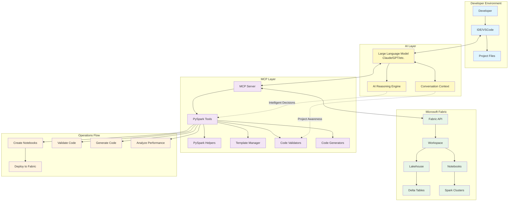

# Microsoft Fabric MCP Architecture with LLM Integration

## Complete Architecture Diagram



## Architecture Components

### **1. Developer Environment**
- **IDE/VSCode**: Primary development interface with MCP integration
- **Developer**: Data engineer/scientist working on PySpark projects
- **Project Files**: Local project structure and configuration

### **2. AI Layer**
- **Large Language Model**: Claude, GPT, or other LLM providing intelligent assistance
- **Conversation Context**: Maintains project context and conversation history
- **AI Reasoning Engine**: Makes intelligent decisions about code generation and optimization

### **3. MCP Layer (This Server)**
- **MCP Server**: Core server handling tool requests from the LLM
- **PySpark Tools**: 11 specialized tools for notebook operations
- **PySpark Helpers**: Template management and code generation
- **Template Manager**: Pre-built notebook templates for different scenarios
- **Code Validators**: Syntax, best practices, and Fabric compatibility checks
- **Code Generators**: Intelligent PySpark code generation

### **4. Microsoft Fabric**
- **Fabric API**: REST API for all Fabric operations
- **Workspace**: Fabric workspace containing resources
- **Lakehouse**: Data storage with Delta Lake tables
- **Notebooks**: PySpark notebooks for data processing
- **Delta Tables**: Structured data storage
- **Spark Clusters**: Compute resources for PySpark execution

### **5. Operations Flow**
- **Create Notebooks**: Generate notebooks from templates
- **Validate Code**: Check syntax, performance, and compatibility
- **Generate Code**: Create PySpark snippets for common operations
- **Analyze Performance**: Evaluate and optimize notebook performance
- **Deploy to Fabric**: Push notebooks and execute in Fabric environment

## Enhanced Interaction Flow with LLM

1. **Developer requests PySpark assistance in IDE**
2. **IDE communicates with LLM (Claude/GPT)**
3. **LLM analyzes request using conversation context and reasoning**
4. **LLM calls MCP server tools based on intelligent analysis**
5. **MCP server processes request using specialized tools**
6. **Tools utilize helpers, templates, and validators**
7. **MCP server calls Fabric API for operations**
8. **Results flow back through MCP to LLM**
9. **LLM processes and formats results intelligently**
10. **Developer receives contextual, intelligent responses in IDE**

## Key Benefits of LLM Integration

### **Intelligent Decision Making**
- LLM analyzes developer intent and context
- Chooses appropriate tools and templates automatically
- Provides contextual recommendations based on project history

### **Natural Language Interface**
- Developers can request features in natural language
- LLM translates requests to appropriate MCP tool calls
- Reduces need to remember specific tool names and parameters

### **Context Awareness**
- LLM maintains conversation history and project context
- Provides consistent recommendations across sessions
- Learns from previous interactions and code patterns

### **Enhanced Code Generation**
- LLM combines multiple tool outputs intelligently
- Provides explanations and documentation with generated code
- Adapts to developer's coding style and preferences

## Example LLM-Enhanced Workflows

### **Scenario 1: Natural Language Request**
```
Developer: "Help me create a PySpark notebook that reads sales data from our lakehouse, 
cleans it, and creates a summary table with performance optimization."

LLM Process:
1. Analyzes intent: notebook creation + data processing + optimization
2. Calls create_fabric_notebook() with ETL template
3. Calls generate_fabric_code() for lakehouse reading
4. Calls validate_fabric_code() for optimization checks
5. Provides complete solution with explanations
```

### **Scenario 2: Performance Optimization**
```
Developer: "My PySpark notebook is running slowly. Can you help optimize it?"

LLM Process:
1. Calls analyze_notebook_performance() on current notebook
2. Calls validate_fabric_code() for anti-pattern detection
3. Calls generate_fabric_code() for optimized alternatives
4. Provides detailed optimization report with before/after comparisons
```

### **Scenario 3: Best Practices Guidance**
```
Developer: "Is this PySpark code following Fabric best practices?"

LLM Process:
1. Calls validate_fabric_code() for compatibility checks
2. Analyzes results with reasoning engine
3. Provides detailed feedback with specific recommendations
4. Suggests alternative approaches using generate_fabric_code()
```

This architecture leverages the power of LLMs to provide intelligent, context-aware assistance while utilizing specialized MCP tools for precise Fabric operations!
