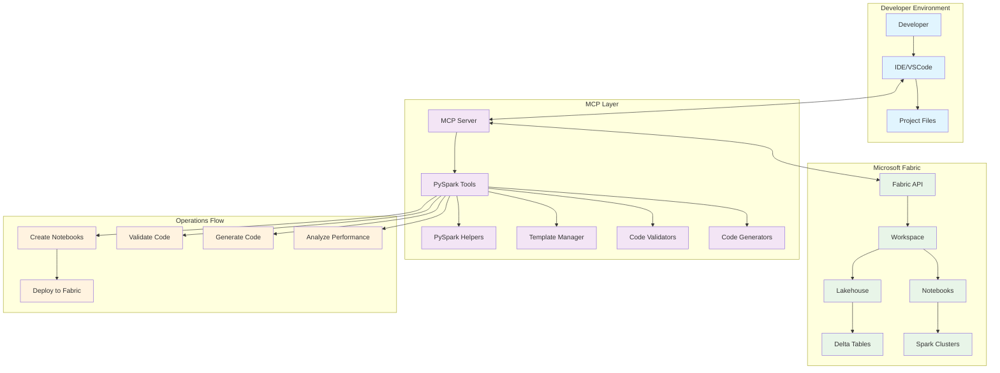

# PySpark Development Guide for Microsoft Fabric MCP

This guide explains how to use the enhanced PySpark capabilities in the Microsoft Fabric MCP server for developing, testing, and optimizing PySpark notebooks.

## Overview

The MCP server now provides comprehensive PySpark development support with:
- 📓 **Advanced notebook templates** for different use cases
- 🔧 **Code generation** for common PySpark operations
- ✅ **Code validation** and best practices checking
- 🎯 **Fabric-specific optimizations** 
- 📊 **Performance analysis** tools
- 🚀 **Execution monitoring** capabilities

## Architecture Diagram



### Architecture Components

#### **1. Developer Environment**
- **IDE/VSCode**: Primary development interface with MCP integration
- **Developer**: Data engineer/scientist working on PySpark projects
- **Project Files**: Local project structure and configuration

#### **2. MCP Layer (This Server)**
- **MCP Server**: Core server handling tool requests
- **PySpark Tools**: 11 specialized tools for notebook operations
- **PySpark Helpers**: Template management and code generation
- **Template Manager**: Pre-built notebook templates for different scenarios
- **Code Validators**: Syntax, best practices, and Fabric compatibility checks
- **Code Generators**: Intelligent PySpark code generation

#### **3. Microsoft Fabric**
- **Fabric API**: REST API for all Fabric operations
- **Workspace**: Fabric workspace containing resources
- **Lakehouse**: Data storage with Delta Lake tables
- **Notebooks**: PySpark notebooks for data processing
- **Delta Tables**: Structured data storage
- **Spark Clusters**: Compute resources for PySpark execution

#### **4. Operations Flow**
- **Create Notebooks**: Generate notebooks from templates
- **Validate Code**: Check syntax, performance, and compatibility
- **Generate Code**: Create PySpark snippets for common operations
- **Analyze Performance**: Evaluate and optimize notebook performance
- **Deploy to Fabric**: Push notebooks and execute in Fabric environment

### Interaction Flow

1. **Developer writes/requests PySpark code in IDE**
2. **IDE communicates with MCP server via protocol**
3. **MCP server processes request using specialized tools**
4. **Tools utilize helpers, templates, and validators**
5. **MCP server calls Fabric API for operations**
6. **Results flow back through MCP to IDE**
7. **Developer receives generated code, validation results, or analysis**

### Benefits of This Architecture

- **Seamless Integration**: Work directly from your IDE without switching contexts
- **Intelligent Assistance**: AI-powered code generation and validation
- **Fabric Optimization**: Specialized tools for Microsoft Fabric environment
- **Performance Focus**: Built-in performance analysis and optimization
- **Template-Driven**: Quick start with proven patterns
- **Real-time Feedback**: Immediate validation and suggestions

## Available Tools

### 1. Notebook Management

#### `list_notebooks`
List all notebooks in a workspace.
```
Usage: list_notebooks(workspace="my_workspace")
```

#### `get_notebook_content`
Retrieve the content of a specific notebook.
```
Usage: get_notebook_content(workspace="my_workspace", notebook_id="notebook_id")
```

#### `create_pyspark_notebook`
Create a notebook from built-in PySpark templates.
```
Usage: create_pyspark_notebook(
    workspace="my_workspace",
    notebook_name="my_pyspark_notebook",
    template_type="basic"  # Options: basic, etl, analytics, ml
)
```

#### `create_fabric_notebook`
Create a notebook optimized for Microsoft Fabric with advanced templates.
```
Usage: create_fabric_notebook(
    workspace="my_workspace",
    notebook_name="fabric_optimized_notebook",
    template_type="fabric_integration"  # Options: fabric_integration, streaming
)
```

### 2. Code Generation

#### `generate_pyspark_code`
Generate PySpark code for common operations.
```
Usage: generate_pyspark_code(
    operation="read_table",
    source_table="lakehouse.my_table",
    columns="id,name,age"
)

Available operations:
- read_table: Read data from tables
- write_table: Write data to tables
- transform: Data transformations
- join: Table joins
- aggregate: Data aggregations
- schema_inference: Schema analysis
- data_quality: Data quality checks
- performance_optimization: Performance tuning
```

#### `generate_fabric_code`
Generate Fabric-specific PySpark code.
```
Usage: generate_fabric_code(
    operation="read_lakehouse",
    lakehouse_name="my_lakehouse",
    table_name="my_table"
)

Available operations:
- read_lakehouse: Read from Fabric Lakehouse
- write_lakehouse: Write to Fabric Lakehouse
- merge_delta: Delta Lake merge operations
- performance_monitor: Performance monitoring
```

### 3. Code Validation

#### `validate_pyspark_code`
Validate PySpark code for syntax and best practices.
```
Usage: validate_pyspark_code(code="df = spark.table('my_table')")
```

#### `validate_fabric_code`
Validate code specifically for Microsoft Fabric compatibility.
```
Usage: validate_fabric_code(code="df = spark.table('my_table')")
```

### 4. Performance Analysis

#### `analyze_notebook_performance`
Analyze a notebook's performance and provide optimization recommendations.
```
Usage: analyze_notebook_performance(
    workspace="my_workspace",
    notebook_id="notebook_id"
)
```

### 5. Notebook Editing

#### `update_notebook_cell`
Update a specific cell in a notebook.
```
Usage: update_notebook_cell(
    workspace="my_workspace",
    notebook_id="notebook_id",
    cell_index=0,
    cell_content="print('Hello, Fabric!')",
    cell_type="code"
)
```

## Template Types

### Basic Templates (`create_pyspark_notebook`)

1. **basic**: Fundamental PySpark operations
   - Spark session initialization
   - Basic DataFrame operations
   - Sample data creation

2. **etl**: ETL pipeline template
   - Extract, Transform, Load patterns
   - Data cleaning and processing
   - Delta Lake integration

3. **analytics**: Data analytics template
   - Aggregations and window functions
   - Advanced analytics patterns
   - Statistical operations

4. **ml**: Machine learning template
   - MLlib pipeline creation
   - Feature engineering
   - Model training and evaluation

### Advanced Templates (`create_fabric_notebook`)

1. **fabric_integration**: Microsoft Fabric integration
   - Lakehouse connectivity
   - Delta Lake operations
   - Fabric-specific utilities

2. **streaming**: Structured Streaming template
   - Real-time data processing
   - Stream-to-Delta operations
   - Windowed aggregations

## Best Practices

### 1. Fabric-Specific Optimizations

✅ **Use managed tables:**
```python
df = spark.table("lakehouse.my_table")  # Preferred
# instead of direct file paths
```

✅ **Use Delta Lake format:**
```python
df.write.format("delta").mode("overwrite").saveAsTable("my_table")
```

✅ **Leverage notebookutils:**
```python
import notebookutils as nbu
workspace_id = nbu.runtime.context.workspaceId
```

### 2. Performance Optimizations

✅ **Cache frequently used DataFrames:**
```python
df.cache()  # Cache before multiple actions
```

✅ **Use broadcast for small tables:**
```python
from pyspark.sql.functions import broadcast
result = large_df.join(broadcast(small_df), "key")
```

✅ **Partition large datasets:**
```python
df.write.partitionBy("year", "month").saveAsTable("partitioned_table")
```

### 3. Code Quality

✅ **Define explicit schemas:**
```python
schema = StructType([
    StructField("id", IntegerType(), True),
    StructField("name", StringType(), True)
])
df = spark.createDataFrame(data, schema)
```

✅ **Handle null values:**
```python
df.filter(col("column").isNotNull())
```

❌ **Avoid these anti-patterns:**
```python
# Don't collect large datasets
for row in df.collect():  # Avoid this
    process(row)

# Don't use .toPandas() on large data
pandas_df = large_df.toPandas()  # Risk of OOM
```

## Workflow Examples

### 1. Creating and Optimizing a PySpark Notebook

```python
# 1. Create a new notebook from template
create_fabric_notebook(
    workspace="analytics_workspace",
    notebook_name="sales_analysis",
    template_type="fabric_integration"
)

# 2. Generate code for specific operations
generate_fabric_code(
    operation="read_lakehouse",
    lakehouse_name="sales_lakehouse",
    table_name="transactions"
)

# 3. Validate the generated code
validate_fabric_code(code="df = spark.table('sales_lakehouse.transactions')")

# 4. Analyze performance
analyze_notebook_performance(
    workspace="analytics_workspace",
    notebook_id="sales_analysis_notebook_id"
)
```

### 2. ETL Pipeline Development

```python
# 1. Create ETL notebook
create_pyspark_notebook(
    workspace="etl_workspace",
    notebook_name="daily_etl",
    template_type="etl"
)

# 2. Generate transformation code
generate_pyspark_code(
    operation="transform",
    columns="customer_id,product_id,amount",
    filter_condition="amount > 0"
)

# 3. Generate Delta merge code
generate_fabric_code(
    operation="merge_delta",
    target_table="sales_summary"
)
```

### 3. Performance Monitoring

```python
# 1. Generate performance monitoring code
generate_fabric_code(operation="performance_monitor")

# 2. Validate for performance issues
validate_fabric_code(code="""
df1 = spark.table("large_table")
df2 = spark.table("small_table")
result = df1.join(df2, "key")
result.collect()  # This will be flagged
""")

# 3. Analyze existing notebook
analyze_notebook_performance(
    workspace="my_workspace",
    notebook_id="existing_notebook_id"
)
```

## Error Handling

The MCP tools provide comprehensive error handling:

- **Syntax validation**: Checks Python syntax before execution
- **Fabric compatibility**: Ensures code works in Fabric environment
- **Performance warnings**: Identifies potential performance issues
- **Best practice suggestions**: Recommends improvements

## Integration with IDE

When using the MCP in your IDE:

1. **Autocomplete**: The MCP provides intelligent code generation
2. **Validation**: Real-time code validation and suggestions
3. **Templates**: Quick notebook creation from templates
4. **Performance insights**: Analyze and optimize existing notebooks

## Troubleshooting

### Common Issues

1. **Context not provided**: Ensure `ctx` parameter is passed to all functions
2. **Invalid workspace**: Verify workspace name or ID exists
3. **Notebook not found**: Check notebook ID or name spelling
4. **Template not found**: Use valid template types listed above

### Getting Help

Use the validation tools to identify issues:
- `validate_pyspark_code()` for general PySpark validation
- `validate_fabric_code()` for Fabric-specific validation
- `analyze_notebook_performance()` for performance insights

## Advanced Features

### Custom Templates

The helper module supports extending templates. You can create custom templates by modifying the `PySparkTemplateManager` class in `helpers/pyspark_helpers.py`.

### Code Generation Extensions

Add new code generation patterns by extending the `PySparkCodeGenerator` class with additional methods for specific use cases.

### Performance Metrics

The performance analysis tool provides:
- Operation counts per cell
- Performance issue detection
- Optimization opportunity identification
- Scoring system (0-100)

This comprehensive PySpark development environment helps you write, test, and optimize PySpark notebooks efficiently in Microsoft Fabric!
